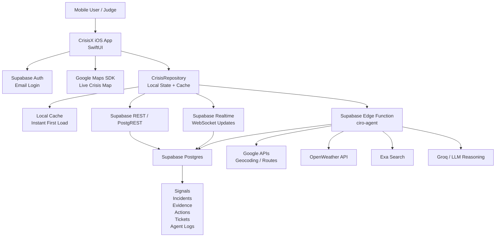
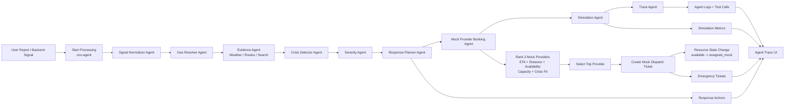
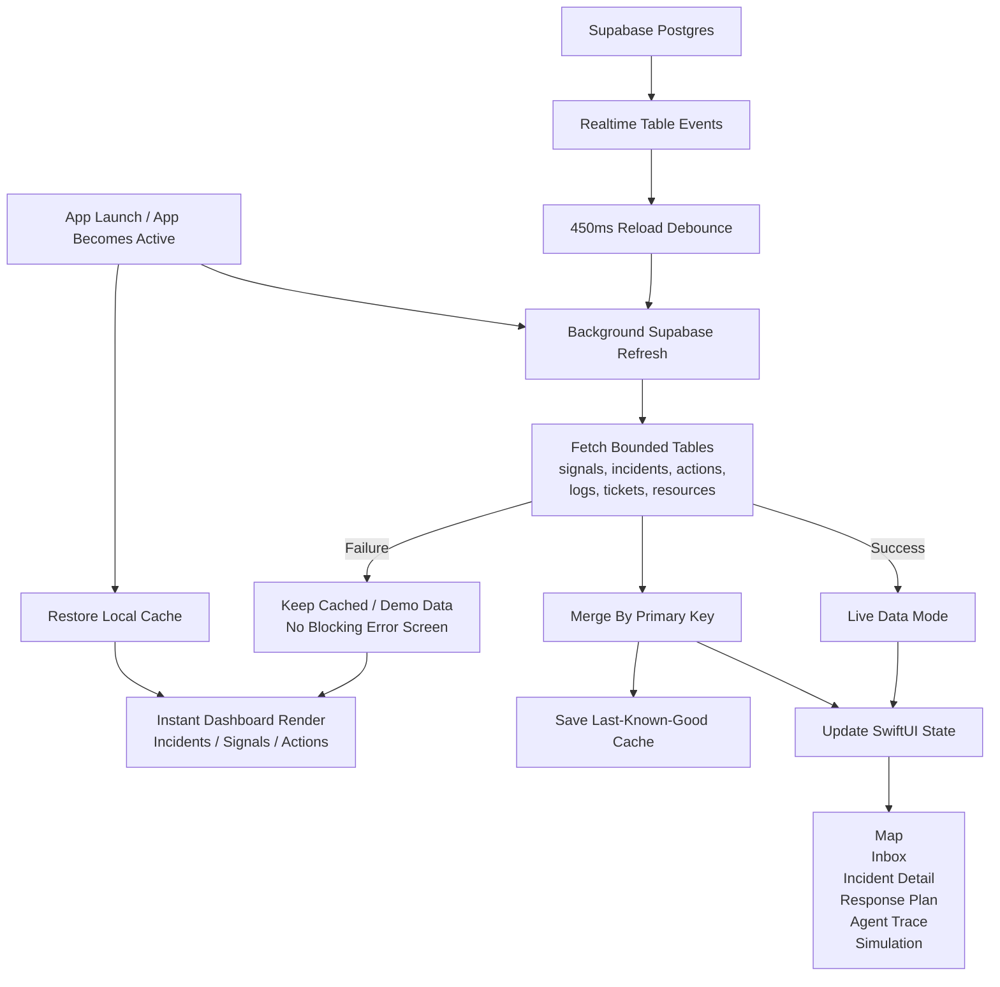
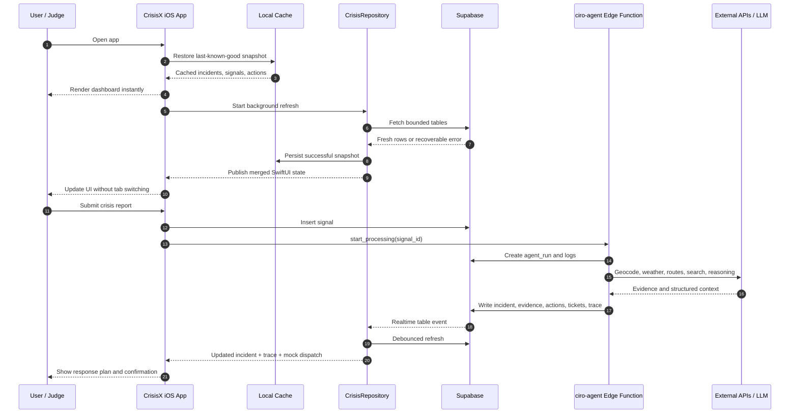

# CrisisX AI Hackathon Documentation

## 1. Project Overview

### Problem statement
During disasters and emergency situations, people often struggle to access reliable and timely information. Reports from different sources can be confusing or unverified, leading to poor awareness and delayed decisions. This project provides a centralized platform that validates crisis-related information and helps improve public awareness and preparedness.

### Purpose of the solution
CrisisX provides a real-time, agentic crisis intelligence workflow that turns user or backend-generated signals into incidents, evidence, response actions, and simulation outcomes. It keeps all decisions and tool calls traceable in Supabase and streams updates live to the iOS client.

### Real-world use case
A crisis operations desk can collect public reports (English, Urdu, Roman Urdu), confirm context with weather and news sources, cluster nearby signals into incidents, and propose coordinated response actions. Operators review a full agent trace and simulated outcomes before any real-world escalation.

### Core objectives
- Normalize and geocode crisis signals with explicit agent traces.
- Enrich incidents with weather, news, and route evidence.
- Plan safe response actions and simulate outcomes without real-world execution.
- Stream live incident state to the mobile UI with full auditability.

## 2. System Design

### Overall solution design
The system is split into a SwiftUI client and a Supabase backend. The client handles authentication, report submission, and live visualization. The backend runs an orchestrated agent pipeline inside a Supabase Edge Function, writing all artifacts to Postgres and streaming them back via Realtime.

### Data flow
1. User submits a report in the iOS app (Report Crisis).
2. The app writes a row to `signals` and calls `ciro-agent` with `start_processing`.
3. The Edge Function queues an `agent_runs` record, then processes the pipeline asynchronously.
4. Agents write `normalized_signals`, `incidents`, `incident_evidence`, `response_actions`, `simulation_runs`, `mock_alerts`, `emergency_tickets`, and `tool_calls`.
5. Supabase Realtime pushes table changes; the app refreshes and renders updates.

### Component interaction
- `AppModel` owns auth state and initializes `CrisisRepository`.
- `CrisisRepository` loads and merges data, invokes the Edge Function, and manages pipeline heartbeat polling.
- `SupabaseService` is a thin REST client for Auth, PostgREST, and Functions.
- `SupabaseRealtimeService` uses a WebSocket subscription to trigger data reloads.

### User interaction flow
- Login/Signup via Supabase email auth.
- Submit a report and watch the Agent Pipeline sheet for live steps.
- Review incidents on the map and open Incident Detail.
- Inspect Response Plan, Agent Trace, and Simulation Outcome per incident.
- Trigger backend-generated signals or simulations from Settings.

## 3. Architecture Overview

### Architecture pattern used
The iOS app follows MVVM with a service layer:
- Models: `Models/CrisisModels.swift`
- ViewModels: `ViewModels/AppModel.swift`, `ViewModels/CrisisRepository.swift`
- Views: `Views/*`
- Services: `Services/SupabaseService.swift`, `Services/SupabaseRealtimeService.swift`

The backend is a single Edge Function with a layered agent pipeline and a structured tool execution layer.

### Frontend structure
- Entry: `com_agenticpulse_crisisApp.swift` initializes Google Maps and injects `AppModel`.
- `ContentView` switches between Auth and main shell based on session.
- Tabbed navigation: Map, Report, Inbox, Settings.
- Shared UI components and skeleton loaders in `Views/Components`.
- Map rendering via Google Maps SDK (with a fallback static view if missing).

### Backend structure
- Supabase Edge Function: `supabase/functions/ciro-agent/index.ts`.
- Agent pipeline with explicit logging and tool calls stored in Postgres.
- Background execution using EdgeRuntime `waitUntil` to keep the app responsive.

### Database and storage handling
- Postgres tables model signals, normalized signals, incidents, evidence, actions, simulations, and audit logs.
- Realtime is enabled for all crisis-relevant tables.
- RLS is enabled on all tables; client writes are scoped to authenticated users.
- Session tokens are stored in iOS Keychain (`KeychainStore`).

### State management
- SwiftUI `@Published` properties in `AppModel` and `CrisisRepository`.
- UI updates driven by Combine and Realtime-triggered reloads.
- Repository merges incoming data by primary key to avoid duplication.

### Service layers
- `SupabaseService`: REST calls for Auth, PostgREST CRUD, and Functions.
- `SupabaseRealtimeService`: WebSocket subscription to table changes.
- Edge Function tool handlers for geocoding, weather, routes, and news.

### Scalability considerations
- Database indexes on status, timestamps, and location fields for high-volume reads.
- Async agent orchestration with stale-run recovery and queued processing.
- UI data loads are bounded (`limit` queries) and throttled reloads (450ms).

### Architecture diagrams

#### System architecture

#### Agentic workflow architecture

#### Data sync and cache architecture

#### Runtime sequence

## 4. Technologies Used

| Area | Technology | Purpose |
| --- | --- | --- |
| Mobile | Swift, SwiftUI | iOS client and UI state management |
| Mapping | Google Maps SDK for iOS | Live map rendering and markers |
| Backend | Supabase Edge Functions (Deno) | Agent pipeline and tool execution |
| Database | Supabase Postgres | Crisis data, logs, and simulation artifacts |
| Realtime | Supabase Realtime WebSocket | Live updates in the app |
| AI Model | Groq OpenAI-compatible API, (Kimi K2.6) as primary and (Llama 3.3 70B) as Fallback Agent | Agent reasoning and structured outputs |
| External APIs | Google Geocoding, Google Routes, OpenWeather, Exa Search | Context and evidence enrichment |

## 5. APIs and Integrations

### Real APIs used
- Supabase Auth REST: `/auth/v1/*` for sign-in/up.
- Supabase PostgREST: `/rest/v1/*` for table reads and writes.
- Supabase Functions: `/functions/v1/ciro-agent` for orchestration.
- Google Geocoding and Routes APIs for location resolution and route candidates.
- OpenWeather for live weather context.
- Exa Search for web/news corroboration.

### Mock APIs used
- Mock alerts and mock emergency tickets are stored in `mock_alerts` and `emergency_tickets` and never sent externally.

### Third-party integrations
- Google Maps SDK for iOS (map rendering).
- Groq OpenAI-compatible chat completions for agent reasoning.

### Authentication methods
- Supabase email/password auth on the client.
- JWT passed to the Edge Function; service role key used server-side for privileged writes.
- Session tokens stored in Keychain.

### Data handling strategy
- All agent outputs are stored in normalized tables with structured JSON payloads.
- Tool calls are logged with arguments, latency, and results for auditability.
- System health is tracked in `system_status`.

## 6. Agents / Intelligent Modules

### Agent pipeline
The Edge Function runs a deterministic pipeline with explicit logging:
1. Signal Normalizer Agent
2. Geo Resolver Agent
3. Evidence Agent
4. Crisis Detector Agent
5. Severity Agent
6. Response Planner Agent
7. Simulation Agent
8. Trace Agent

### Automation and decision systems
- Rule-based severity scoring blended with AI reasoning (`rulesSeverity`).
- Incident clustering against nearby signals and active incidents.
- Automatic creation of simulated response actions, tickets, alerts, and metrics.
- Recovery paths for stale runs and planner failure (`fallbackResponsePlan`).

### Monitoring systems
- `system_status` includes orchestrator health and recovery hints.
- Agent logs and tool calls provide a full audit trail.

## 7. Core Features

### Main functionalities
- Secure login and session persistence.
- Crisis report submission with category and urgency.
- Live map visualization of signals, incidents, routes, and blocked segments.
- Incident detail view with evidence, actions, trace, and simulation outcomes.
- End-to-end mock provider booking: three app-owned emergency resources are ranked by ETA, distance, availability, capacity, and crisis-type fit; the top provider is assigned and a mock dispatch confirmation is written.
- Backend-generated test signals and manual simulation triggers.

### Security implementation
- RLS enabled on all tables.
- Client uses anon key only; server uses service role key.
- Keychain storage for access tokens.

### Performance optimization
- Query limits and ordered reads for large tables.
- Realtime-triggered reload with throttling.
- Skeleton loaders to avoid blocking UI during initial load.

### Error handling
- Uniform error surface via `APIError`.
- Edge Function marks runs as failed and updates `system_status` on errors.
- Stale run recovery for pipelines exceeding heartbeat thresholds.

### Background services
- Edge Function uses background tasks to continue long-running agent pipelines.
- Client shows a heartbeat-based progress sheet for long workflows.

### Notifications and alerts
- Alerts and tickets are simulated and stored in Supabase tables; no real dispatch.
- Provider booking is simulated end-to-end: resources move from `available` to `assigned_mock`, and the confirmation ID plus ranking rationale are stored in `agent_logs`, `response_actions`, and `emergency_tickets`.

## 8. Technical Implementation Details

### Folder structure
- `Core/`: configuration, theming, JSON handling, Keychain, and error types.
- `Models/`: data models aligned with Supabase tables.
- `Services/`: Supabase REST and Realtime networking.
- `ViewModels/`: session + repository state and orchestration.
- `Views/`: SwiftUI screens and components.
- `supabase/`: SQL migrations and Edge Function.

### Important modules
- `CrisisRepository`: primary data hub; load/merge, pipeline calls, and simulations.
- `SupabaseService`: Auth, PostgREST, Functions with timeout handling.
- `SupabaseRealtimeService`: WebSocket subscriptions for table changes.
- `ciro-agent` Edge Function: full agent pipeline and tool execution.

### Key classes/services
- `AppModel`: app lifecycle, auth, and repository bootstrap.
- `CrisisRepository`: orchestrates read/write operations and pipeline state.
- `KeychainStore`: secure local session persistence.

### Design decisions
- Asynchronous pipeline in Edge Function to avoid blocking the mobile UI.
- Strict logging of every agent and tool call for audit trails.
- Simulation-only actions to keep the system safe and compliant.

### Why specific technologies were selected
- Supabase offers Postgres + Realtime + Edge Functions in a single managed stack.
- SwiftUI enables rapid, reactive UI updates for live data.
- Google Maps SDK provides reliable map rendering and overlays.

## 10. Future Improvements

- Implement pagination and incremental loading for large data sets.
- Add role-based UI and permissions to match `profiles.role`.
- Expand system status with per-agent KPIs and queue metrics.
- Introduce background refresh and local caching for offline readiness.
- Align AI provider configuration between documentation and Edge Function settings.
- Add integration points for real dispatch systems while keeping strict safety boundaries.

## 11. Team Name
- CrisisX AI
- Hamza Akmal
- Abdullah Saif
- Kamran Ashraf
